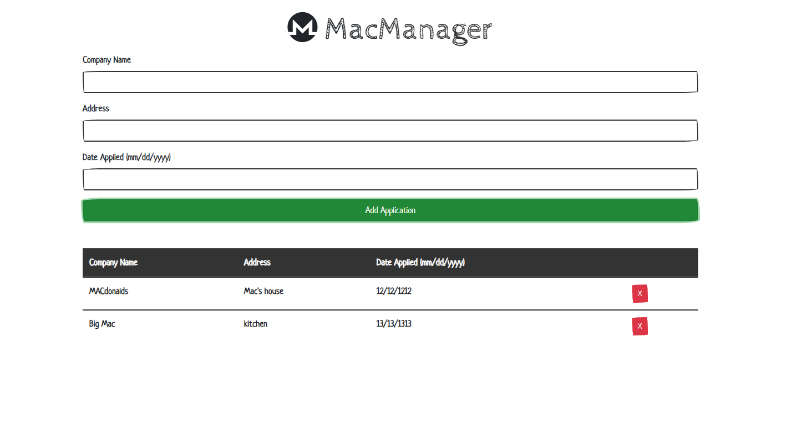

# LocalMac

### Running the Application
 * Clone repository
 * Open the project in the browser

### How it works
Information created from the form will be saved in local storage. This means the data will persist even if the browser is closed and will only be erased when the local storage data is manually cleared.

### Technology used
* HTML
* Javascript
* Bootstrap
* Font Awesome
* Bootswatch